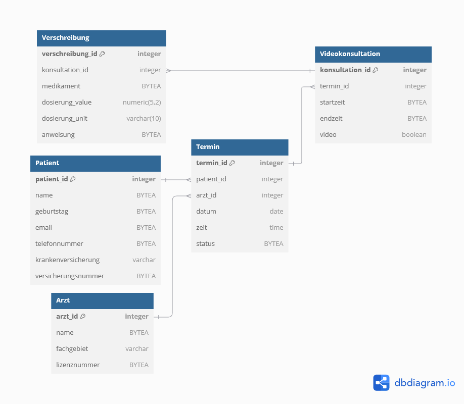

# data_pseudonymizer  🚀

### Dein Schlüssel zur DSGVO-konformen Datenpseudonymisierung und Verschlüsselung! 🔐

Diese App ist deine Komplettlösung für DSGVO-konforme **Datenpseudonymisierung** und -verschlüsselung auf einer PostgreSQL-Datenbank – bereitgestellt durch eine skalierbare Docker-Umgebung. Stell dir vor, wie du mit einem einzigen Befehl eine sichere, verschlüsselte Datenbank erstellst, befüllst und schützt – und das Ganze mit einem Hauch von Magie (und natürlich `pgcrypto` von PostgreSQL)!

### 🚀 Was macht **data_pseudonymizer** so besonders?

**data_pseudonymizer** befüllt eine PostgreSQL-Datenbank mit synthetischen, realistisch wirkenden Datensätzen. Diese personenbezogenen Daten werden mit Python auf Datenbankebene verschlüsselt, so dass sie sicher und nur durch Entschlüsselung lesbar sind – keine Sorge also um neugierige Augen! Dank der`pgcrypto`-Erweiterung, insbesondere der Funktion `pgp_sym_encrypt()`, wird eine leistungsstarke und dennoch flexible Verschlüsselung geboten.

### ⚙️ Fancy Technologie, einfach gemacht!

- **Daten-Generierung mit `Faker`**: Die `Faker`-Bibliothek hilft dabei, lebensechte und synthetische Daten zu erstellen – alles von Namen bis zu medizinischen Verschreibungen. Deine Daten könnten echter nicht aussehen!
- **Datensicherheit auf PostgreSQL-Ebene**: Sensible Informationen werden im `BYTEA`-Format gespeichert – verschlüsselt und unlesbar ohne den geheimen Schlüssel.
- **Umgebungsvariabler Schlüssel**: Der `secret_key` zur Datenverschlüsselung wird als Umgebungsvariable gespeichert. Das bedeutet, dass der Schlüssel niemals in deinem Code hardcoded wird.
- **Sichere Nutzerrechte**: Im Docker-Container läuft ein beschränkter Nutzer nur mit Lese- und Ausführrechten – extra Sicherheit, um deine sensiblen Informationen zu schützen.

### 💻 Keine System-Overloads – nur pure Docker-Power!

Vergiss endlose Installationsanleitungen! Dank **Docker** und **Docker Compose** brauchst du nichts weiter als ein paar Kommandos, um loszulegen. In Sekundenschnelle sind deine Container hochgefahren, die App läuft und du kannst sicher loslegen. 

## 📖 Schnellstart-Anleitung

#### 1️⃣ Voraussetzungen

Bevor wir anfangen, stelle sicher, dass du Docker und Docker Compose installiert hast. Falls nicht – keine Sorge, ein paar Klicks genügen! 

#### 2️⃣ Los geht’s! 🚀

In deinem `/data_pseudonymizer`-Verzeichnis:

1. **Starte die App**:
   ```bash
   docker-compose up --build
2. **Beende die App**:
    ```bash
    docker-compose down
3. **Bereinige Volumes (falls du neu starten möchtest)**:
    ```bash
    docker volume rm $(docker volume ls -q)

> **Pro-Tipp**: _Das war’s!_ Mit diesen drei einfachen Schritten bist du bereit, die Power der Datenverschlüsselung und -pseudonymisierung zu erleben – sicher und DSGVO-konform. 🎉

## 📊 Datenmodell der Datenbank
Um einen besseren Überblick über die Datenstruktur zu geben, findest du hier das **Datenmodell**, das zeigt, wie die Tabellen miteinander verknüpft sind. Es veranschaulicht die Relationen zwischen Patienten, Ärzten, Terminen und Verschreibungen, sowie die eingesetzten Verschlüsselungen auf bestimmten personenbezogenen Feldern.

> **Hinweis**: Felder, die im `BYTEA`-Format gespeichert sind, sind verschlüsselt und nur mit dem geheimen Schlüssel (`secret_key`) zugänglich.


